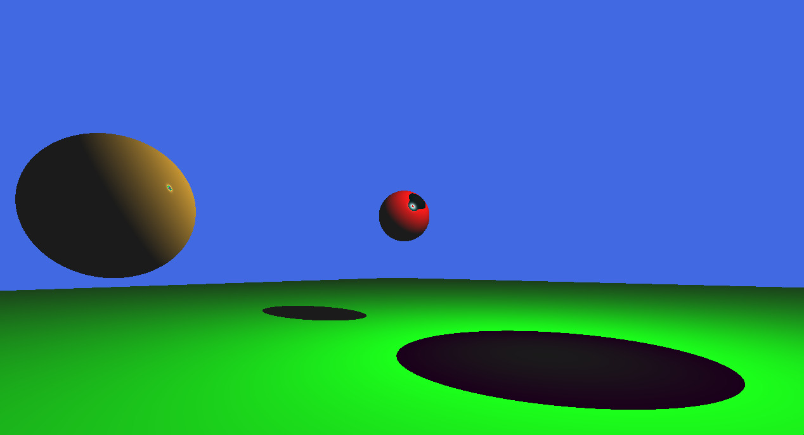

# Projeto de Ray Caster - Prova 1 de Computação Gráfica

Este projeto é uma implementação de um renderizador por Ray Casting, desenvolvido como parte da Prova 1 da disciplina de Computação Gráfica (2025) da Universidade Federal de Mato Grosso do Sul (UFMS), lecionada pelo Prof. Paulo Pagliosa com sua engine [Ds](https://github.com/paulo-pagliosa/Ds).

O programa lança raios a partir de uma câmara em projeção perspectiva para renderizar uma cena 3D composta por esferas e planos, calculando a iluminação de Phong para cada ponto de interseção.



## Dependências e Instalação

O projeto requer um compilador C++20, CMake e a biblioteca GLFW3.

### Linux 

+ **(Ubuntu/Debian):**
    ```bash
    sudo apt install build-essential g++ cmake libglfw3-dev
    ```

+ **(Arch):**
    ```bash
    sudo pacman -S base-devel cmake glfw
    ```

+ **(Fedora/RHEL):**
    ```
    sudo dnf install @development-tools gcc-c++ cmake glfw-devel 
    ```

+ **Zypper (openSUSE):**
    ```bash
    sudo zypper install -t pattern devel_basis gcc-c++ cmake glfw-devel
    ```

### Windows

#### 1. Instalar Clang (LLVM-MinGW)

Abra um terminal **PowerShell como Administrador** e execute o seguinte comando do `winget`:

```powershell
winget install --id=MartinStorsjo.LLVM-MinGW.UCRT -e
```

Adicione o Clang a suas variáveis de ambiente do sistema:

```powershell
[Environment]::SetEnvironmentVariable("Path", $env:Path + ";C:\Program Files\LLVM\bin", "Machine")
```

#### 2. Instalar o CMake

Baixe e instale a versão mais recente do CMake para Windows a partir do site oficial:

https://cmake.org/download/

#### 3. Baixar os Binários do GLFW

Baixe os binários pré-compilados do GLFW:

Vá para https://www.glfw.org/download.html

Baixe os "64-bit Windows binaries".

Descompacte o arquivo .zip em um local de sua escolha.

## Como Compilar e Executar

### Linux

1.  Clone o repositório.
    ```bash
    git clone https://github.com/WilkerSebastian/p1_cg
    ```
2.  Entre no diretório de compilação:
    ```bash
    cd build
    ```
3.  Execute o CMake:
    ```bash
    cmake ..
    ```
4.  Compile o projeto:
    ```
    cmake --build .
    ```
5.  Execute o programa:
    ```bash
    ./p1_cg
    ```

### Windows

1.  Clone o repositório.
    ```powershell
    git clone https://github.com/WilkerSebastian/p1_cg
    ```
2.  Entre no diretório de compilação:
    ```powershell
    cd build
    ```
3.  Execute o CMake:
    ```powershell
    cmake .. -G "MinGW Makefiles" -DGLFW_INCLUDE_DIR="<CAMINHO GLFW>/include" -DGLFW_LIBRARY="<CAMINHO GLFW>/lib-mingw-w64/libglfw3.a"
    ```
4.  Compile o projeto:
    ```powershell
    cmake --build .
    ```
5.  Execute o programa:
    ```powershell
    .\p1_cg.exe
    ```